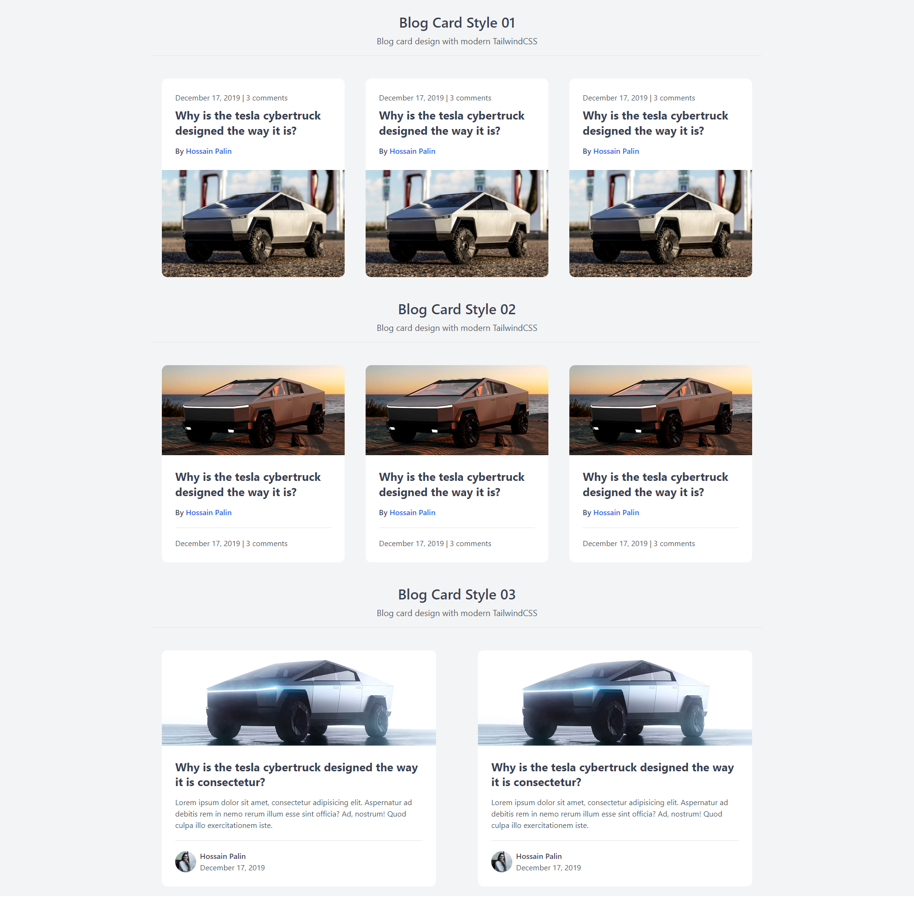

## Elegant Blog Cards Designed with HTML and Tailwind CSS

Discover a collection of meticulously crafted blog cards that blend sleek design with seamless functionality. Each card is meticulously structured using HTML and enhanced with Tailwind CSS, ensuring optimal performance and visual appeal.

## Key Features:

- Visual Appeal: Vibrant images and balanced layouts draw readers in at first glance, setting the tone for an immersive reading experience.
- User-Friendly: Designed with user experience in mind, these cards are intuitive and easy to navigate, enhancing engagement and interaction.
- Responsive Design: Ensuring compatibility across devices, from desktops to mobile phones, maintaining consistency without sacrificing aesthetics.
  -Customizable: Tailwind CSS’s utility-first approach allows for effortless customization, ensuring each blog card reflects your unique style and branding seamlessly.

## Why Choose Our Blog Cards?

Perfect for bloggers, content creators, and businesses alike, our blog cards elevate content presentation while maintaining functionality and accessibility. Whether showcasing latest posts, featured articles, or trending topics, these cards are designed to captivate and inform your audience effectively.

## Contribution

If you'd like to contribute to this project, feel free to submit a pull request. Before doing so, be sure to create a separate branch for your changes.

## Buy A Coffee

Like my works and want to support me?

## Screenshots

## Live demo

Live previews are the best way for a better understanding of the application's user interface.

[Click here...](https://hossainpalin.github.io/Blog-Cards-TailwindCSS)
